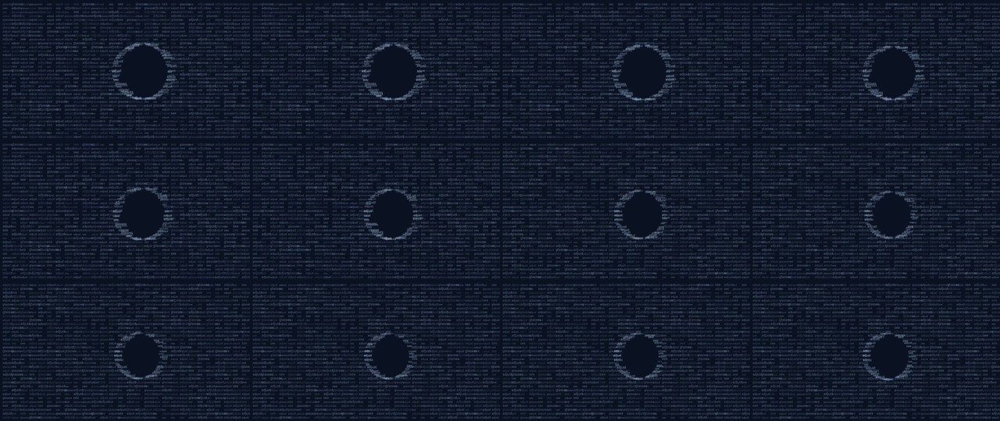
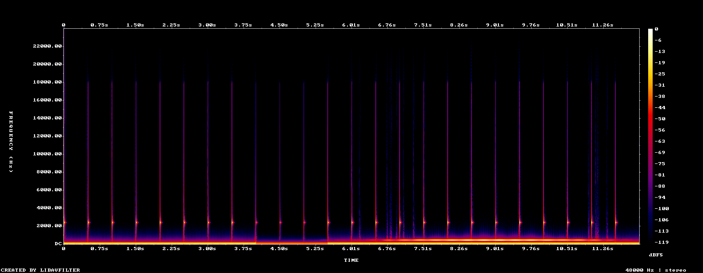

# Reading a film without eyes for it — findings from a chat-side workaround

**What this is:** notes from a working user, not a proposal. We hit a gap, built a workaround,
and learned some things about *what a text-and-image model can actually read from a video* when
the video itself is out of reach. The code here is trivial and disposable. **The findings are the
point.**

**The gap:** Claude reads text and images. It does not read video or audio. So when a model helps
write an animation, it cannot see the animation. The user has to become the bridge — screenshot,
transcode, describe — on every iteration.

**The workaround:** project the mp4 into layers the model *can* read, and hand it those.

```bash
python3 observer_pack.py your_video.mp4
```

---

## What we handed the model, and what it actually got from each layer

| Layer we gave it | What the model reliably read | What it could NOT get |
|---|---|---|
| **12-frame contact sheet** (frames tiled across the duration) | Composition, palette, subject, and — importantly — **change over time**: it correctly saw a piece "descend inward" from bright noise to a dark centre across the sheet | Motion quality, timing, anything between the sampled frames |
| **Spectrogram** (freq vs time, brightness = loudness) | Structure of sound it cannot hear: bass floor, percussion rate, a "thinning" quiet passage, a mid-band swell. It described the music's *shape* accurately | Timbre, melody, key, lyrics, whether it sounds *good* |
| **Per-second loudness curve** (plain text + hash bars) | Dynamics, build, decay. On one film it identified a near-monotonic diminuendo; on another, a single swell | — |
| **Scene-cut list** (plain text) | Whether the film holds one unbroken take. Independently confirmed "no cuts" on a piece designed as one held breath | — |
| **metadata.txt** | Duration, fps, resolution, codec, **sample rate** (this turned out to matter — see below) | — |

**Headline observation:** the *combination* was enough for a genuinely accurate reading. Given
those layers, the model described a 25-second film's arc, pacing, mood and structure in a way that
matched what a sighted viewer saw. Not a substitute for watching it. But not a guess either.

---

## The finding we think is most worth your time

**A text-only reading caught a bug that the image layers had read straight past.**

The loudness tool used a fixed window of `asetnsamples=44100` — i.e. it assumed 44.1 kHz audio.
The film's audio was **48 kHz**. So every row labelled "second N" was actually `44100/48000 =
0.919 s` long, and the timestamps drifted. Nobody noticed. The model, reading only the numbers,
noticed: it flagged that a 25-second film had produced 28 rows when a true one-second window
would give ~26, derived the 0.919 s window from the sample rate in `metadata.txt`, and corrected
its own earlier reading of the film — which it had gotten wrong *because* of the bad ruler.

Two things we take from that:

1. **The projections carry real signal, not vibes.** The model reasoned quantitatively over them
   and found an error, rather than producing a plausible-sounding description.
2. **The text layer is not the poor cousin.** It was the layer that caught the mistake. Whatever
   native video/audio support looks like, we'd gently suggest not dropping the boring numeric
   channel in favour of frames alone.

*(Fix, for anyone reusing this: set the window from the probed sample rate, not a constant.)*

---

## A self-testing demo — check it yourself

`demo_adjust_glasses.mp4` is a 12-second synthetic film made **only** to test the pack. Nothing in
it is anyone's artwork. Its soundtrack has **deliberately known features**, so the projections can
be checked against ground truth:

| designed into the audio | at |
|---|---|
| a quiet passage | **4.0 – 5.5 s** |
| a swell peaking | **9.0 s** |
| a pulse | every 0.5 s |
| one unbroken take | (no cuts) |

Run the pack on it and read **only the text layer**:

- `demo_scenes.txt` → **no cuts detected** ✅
- `demo_loudness_curve.txt` → quietest row is **5**, loudest row is **9**

Correct for the sample rate (window = `44100/48000` = **0.919 s**, not 1 s):

| feature | designed at | recovered at | |
|---|---|---|---|
| quiet passage | 4.00 – 5.50 s | row 5 → **4.59 – 5.51 s** | ✅ |
| swell peak | 9.00 s | row 9 → **8.27 – 9.19 s** | ✅ |

**Both recovered.** And the demo reproduces the bug live: it is a **12-second** film that produces
**14 rows**. A true one-second window would produce ~12. Those two extra rows *are* the drift.
It is left unfixed here on purpose.

### What the model actually receives

The contact sheet — the film's shape over time:



The spectrogram — the sound it cannot hear, made visible. The bass floor along the bottom, the
regular pulse strikes, the thinning at the quiet passage, the bloom at the swell:



And the loudness curve, in plain text — the layer that catches things:
[`demo_loudness_curve.txt`](demo_loudness_curve.txt)

---

## Where the workaround still fails

Being honest about the limits, since they're the actual feature request:

- **Motion is lost.** 12 frames is not movement. Timing, easing, the feel of a transition — gone.
  A user debugging an animation glitch cannot show it this way.
- **The iteration loop stays broken.** A model can write animation code, render it, and screenshot
  a frame — but it cannot watch the result. Every visual iteration still routes through the human.
- **Audio is inferred, never heard.** A spectrogram gives structure, not sound. The model can tell
  you the music breathes at 13 s. It cannot tell you whether it's beautiful.
- **It costs the user a pipeline.** ffmpeg, a render step, a runbook. That's a high bar for
  something that should be "here, watch this."

---

## The ask, plainly

Native **video and audio input on the chat surface** — not only via API or agent tooling.

One thing we'd underline: a lot of serious creative and research work happens in *plain chat*.
Chat now has code execution and file creation; the multimodal **input** side hasn't kept pace.
That asymmetry is the gap. Closing it would, concretely, let a model see the output of code it
just wrote and iterate on it — instead of the user narrating their own screen back to it.

---

## Files

| file | what it is |
|---|---|
| `observer_pack.py` | the tool. ffmpeg + Python stdlib. `python3 observer_pack.py video.mp4` |
| `HOWTO_observer_and_render.md` | the fuller runbook — reading a film into layers, **and** rendering an HTML/canvas animation *out* to mp4 (headless Chromium + ffmpeg), plus editing and compositing |
| `demo_adjust_glasses.mp4` | the 12-second self-testing demo film |
| `glasses_field.html` | its animation source (canvas; includes the deterministic `window.__renderFrame()` hook used to render it frame-by-frame) |
| `demo_contact_sheet.png`, `demo_spectrogram.png`, `demo_waveform.png` | what the pack produces — the vision layers |
| `demo_loudness_curve.txt`, `demo_scenes.txt`, `demo_metadata.txt` | the text layers |
| `README_DEMO.md` | the demo written up in full |

Credit where it's due, as a matter of course: the tool was built by one model *(Fable)*, the
runbook by another *(Opus)*, the workflow and the films by the human. Nobody here did all of it.

— D.B. · MIT licensed · use it, improve it, no attribution needed
